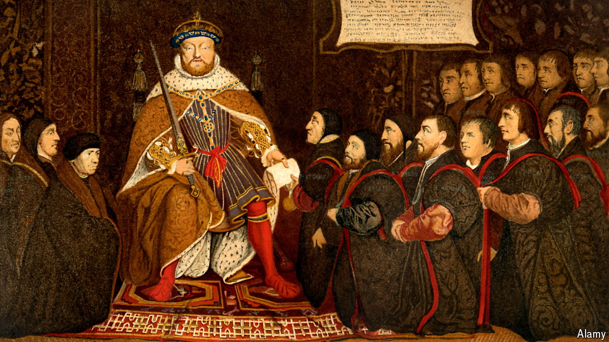

###### Poor law

# The Labour government picks up a bad Tory habit 

##### Expansive and rushed legislation remains a problem 

 

> Nov 4th 2024 

LEGAL types who were troubled by the previous Conservative government’s low regard for Parliament took heart from a speech delivered on October 14th by Richard Hermer, the new attorney-general. In an address titled “The Rule of Law in an Age of Populism”, he said that a decade of instability had “stretched the fabric of our constitution to its limit”. Lax lawmaking, he said, had “the effect of concentrating immense power in the hands of the executive”; he promised a “reset”.

