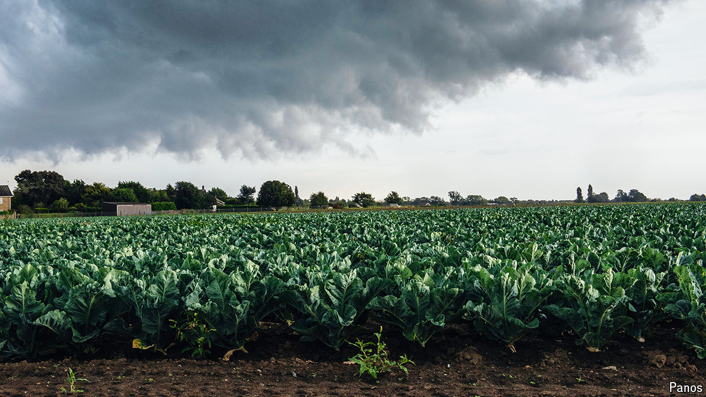

###### Becoming more European

# Two groups are least happy about Labour’s budget 

##### Businesses and farmers will be hit with more tax 

 

> Nov 7th 2024 

British farmers are not usually ones for public protest. While their continental colleagues block roads with tractors and dump manure at the slightest provocation, they . But on November 19th farmers will gather in Westminster for a rally and a “mass lobby”, to protest against the Labour government’s first budget. A “good show” is promised. That is only one way in which the budget threatens to make Britain more European. 

