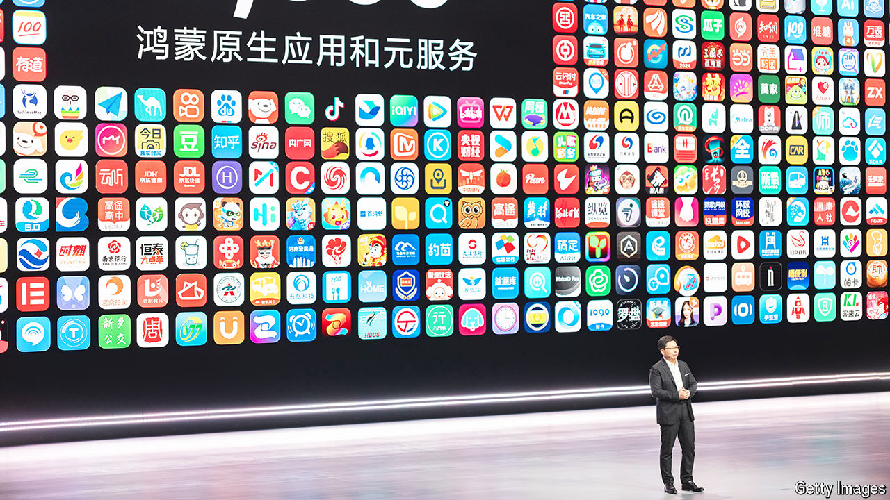

###### Harmony and enmity

# Huawei’s new made-in-China software takes on Apple and Android 

##### With its latest operating system, it is cutting ties with Western tech 

 

> Nov 5th 2024 

When Huawei, the , releases its latest  this month, techies across the world will strip it down to figure out how it works. The semiconductors powering the Mate 70, as the device is called, will reveal how much progress China has made in building its own chips and breaking its reliance on foreign technology. But the software in the phone may prove more important than the hardware. Huawei is expected to install HarmonyOS NEXT, its new home-made operating system, on the devices. This would be China’s first clean break with the Western-backed systems on which it and the rest of the world rely.

