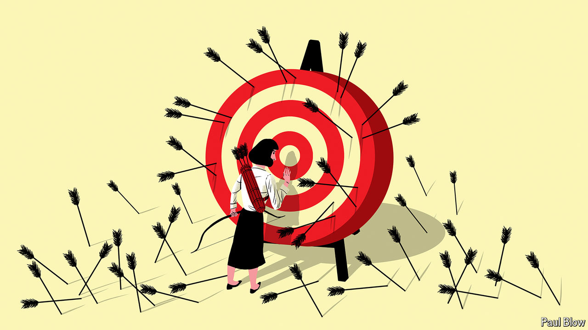

###### Bartleby

# Why being wrong is good for you 

##### Even the most prolific blunderers can go on to do great things 

 

> Nov 7th 2024 

“Mistakes are the portals of discovery,” wrote James Joyce in “Ulysses”. In 1888 Lee Kum Sheung, a young cook in a coastal province in southern China, forgot the oyster soup he was boiling on the stove until it simmered down to a thick, sticky gravy. Once he discovered how tasty it was, he decided to sell his “oyster sauce” in jars. That lucky mistake would make him and his heirs rich. According to , the Lee siblings—his great-grandchildren—are worth $17.7bn, making them the fourth-richest family in Hong Kong. 

