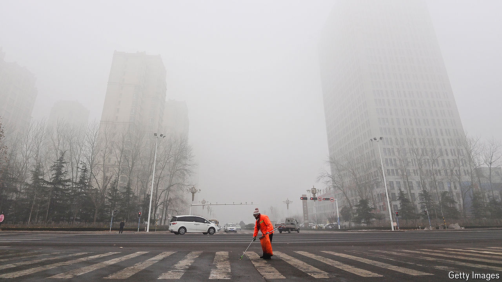

###### China’s economy

# Chinese netizens wonder if their economy is in “garbage time” 

##### As the government tries to stimulate growth, some gloomily ponder the long term 

 

> Nov 7th 2024 

These have been heady times for players of China’s stockmarkets. After the government began ramping up measures in late September to inject new life into a flagging economy, share prices soared, before settling back a bit as investors waited for details. Senior legislators are poised to reveal more stimulus measures on November 8th. But public anxiety about the economy’s long-term prospects may prove hard to dispel. That was true even before Donald Trump, who is threatening massive tariffs on Chinese goods, became America’s president-elect.

