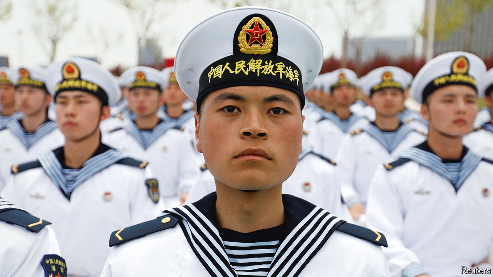

###### Eagle v Dragon

# In some areas of military strength, China has surpassed America 

##### The modernisation of the PLA is proceeding at an extraordinary pace 

 

> Nov 4th 2024 

As he prepares for a second term, Donald Trump will receive the same simple message from all 18 of America’s intelligence agencies: Russia may be causing mayhem in Europe, but only China has the wherewithal to mount a global challenge. “Beijing is accelerating the development of key capabilities,” said the co-ordinating body for American spooks last year. Those capabilities, it added, are ones that China “believes the People’s Liberation Army (PLA) needs to confront the United States in a large-scale, sustained conflict”.

