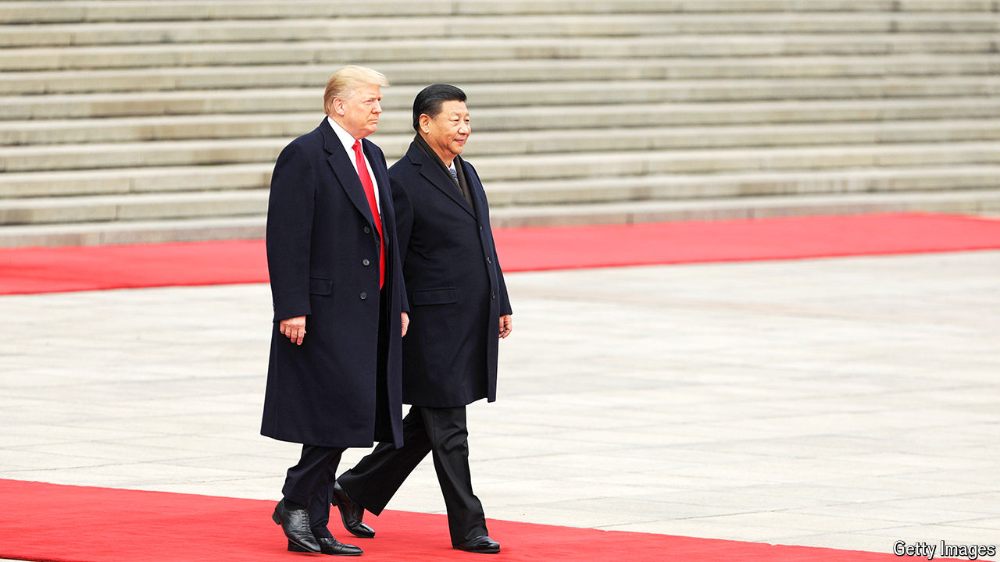

###### Challenges and opportunities

# Is the return of Donald Trump China’s dream or nightmare? 

##### His election is a propaganda win, but he poses real dangers for the Communist Party 

 

> Nov 7th 2024 

For Communist Party leaders, Donald Trump’s electoral success confirms their deepest prejudices about the decline of America and the decadence of its democracy. Towards the end of Mr Trump’s first term, Chinese officials privately shared their judgment that he did not know much about the world—and that all he really cared about were his own interests. They ascribed his victory in 2016 to populism, driven by inequality and the heartlessness of American society. His re-election is unlikely to shake those views.

