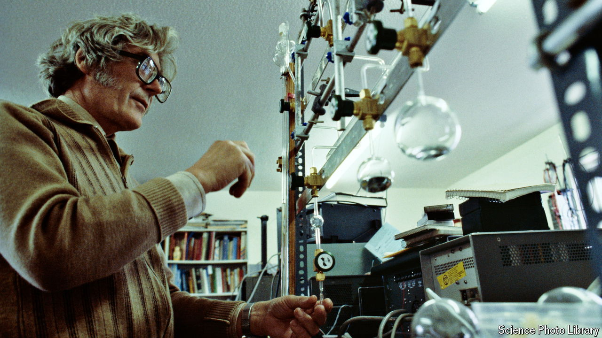

###### Earth father

# Can a biography capture the complexity of a long life? 

##### James Lovelock, an important scientist, is a fascinating and fulfilling subject 

 

> Nov 7th 2024 

 By Jonathan Watts.

