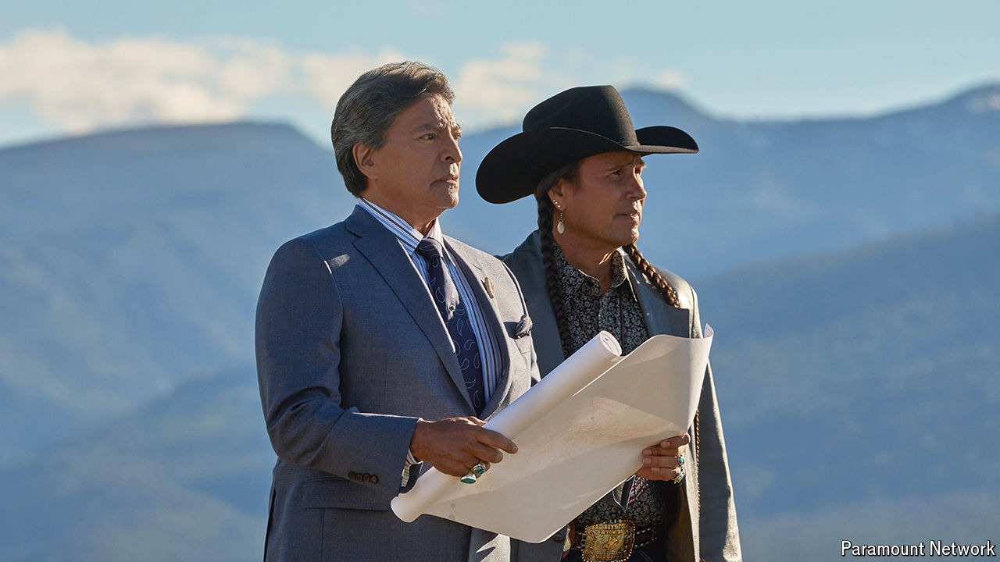

###### The riled west

# Montanans are ready for “Yellowstone” to end 

##### The hit series brought Montana to the masses—and the masses to Montana 

 

> Nov 5th 2024 

TAYLOR SHERIDAN’S  is a place where ranchers fight militias, divert rivers with dynamite, run for governor in their spare time and commit murder (although they prefer driving to  to do so). Mr Sheridan is the creator of “Yellowstone”, a television drama that premiered in 2018 about the Dutton family and the lengths they will go to in order to hold on to their immense ranch. John Dutton, played by a tanned and leathery-looking , is the family patriarch and godfather of the Rockies, hellbent on keeping Montana free of new housing developments and New Yorkers on holiday. “I am the opposite of progress,” he growls, when announcing his campaign for governor. “I am the wall it bashes against.” 

