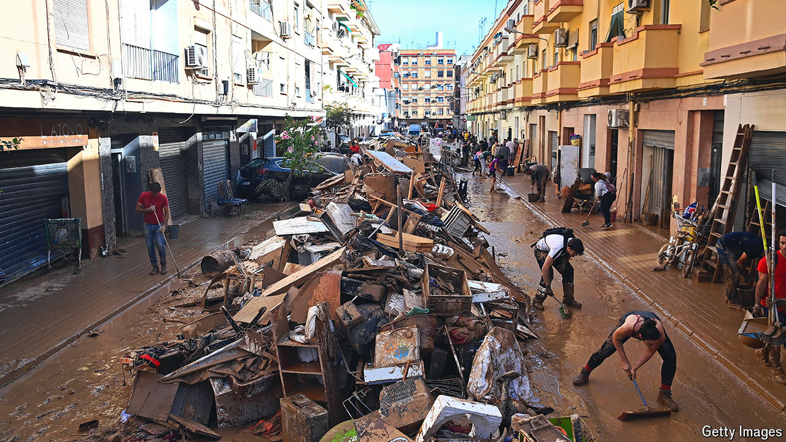

###### After the waters fell

# Spain’s flood poses far-reaching political questions 

##### Over 200 died. Who is being blamed? 

 

> Nov 7th 2024 

The Rambla deL Poyo is once again the innocuous little stream it normally is. Yet in a matter of hours on October 29th it and two other nearby rivers turned into raging torrents,  just south of Valencia, Spain’s third city. Muddy water came to chest level. Many of the 219 people so far known to have died, with at least another 89 still missing, were trapped in ground floors or basements, or trying to take their cars out of underground car parks. 

