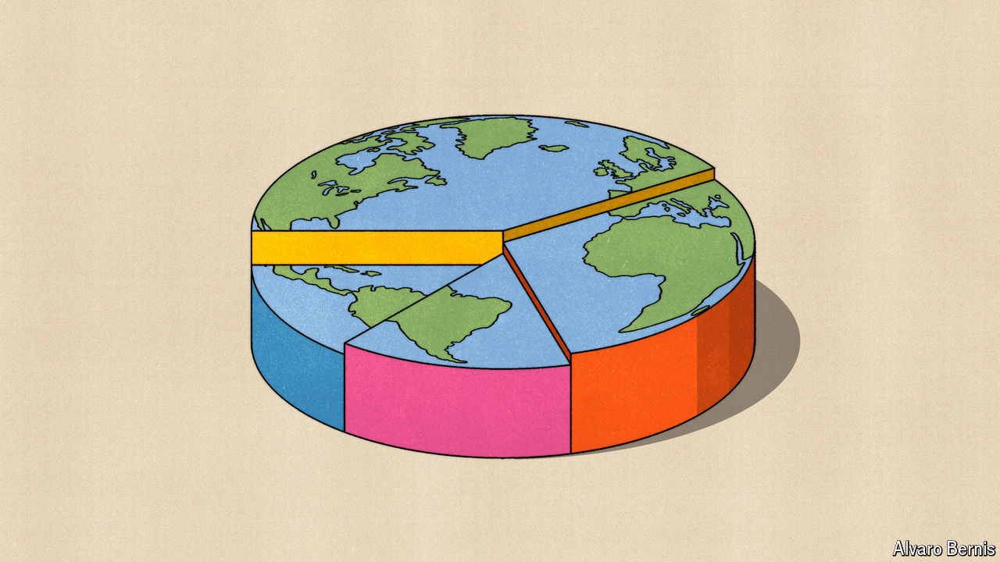

###### Free exchange

# Big Macs, strawberry jam and the wealth of nations 

##### Alan Heston, a pioneer in comparing economies, died on October 25th 

 

> Nov 7th 2024 

WHEN CHINA entered the Korean war in 1950, America was keen to take the measure of its new adversary. The government asked William Hollister to estimate the size of its GDP, relative to America’s own. Economists are often accused of giving two answers to any question. Hollister gave three. 

