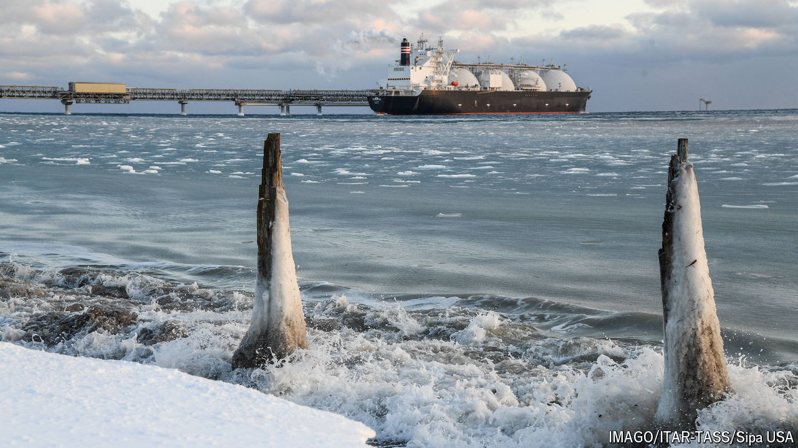

###### The ships are down

# Sanctions are sinking Russia’s flagship gas project 

##### Whether that lasts is up to Donald Trump 

 

> Nov 7th 2024 

The West’s economic weapons are missing their target. Last month Russia exported near-record volumes of oil, at a decent price. But there is one exception. After shutting its main gas pipeline to Europe in 2022, Russia had hoped that Arctic LNG 2, an ultra-modern export facility, would open big new markets. Yet last month the plant suspended operations until next summer, for want of ships and buyers. Sanctions are nipping it in the bud. 

