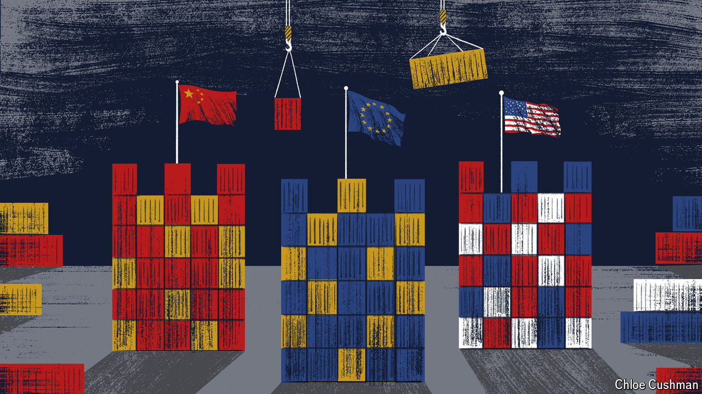

###### The Telegram

# The world faces its worst trade wars since 1930s 

##### Donald Trump’s re-election accelerates a crisis for globalisation 

 

> Nov 7th 2024 

THE WORLD stands on the brink of multiple trade wars. Some will be unleashed with enthusiasm by Donald Trump, a man who hails tariffs as “the greatest thing ever invented”. Yet other, more reluctant clashes will surely follow, begun by blocs and countries whose prosperity depends on access to foreign markets. Expect those unhappy warriors, notably those based in Beijing and Brussels, to insist that—if forced into battle—their aim is to keep markets open and competition fair, not to tear the system down. Alas, the distinction matters less than defenders of globalisation hope. History records many examples of protectionists wreaking economic havoc. But trade-friendly governments often feel obliged to retaliate, too, rather than stand accused of abandoning domestic industries.

