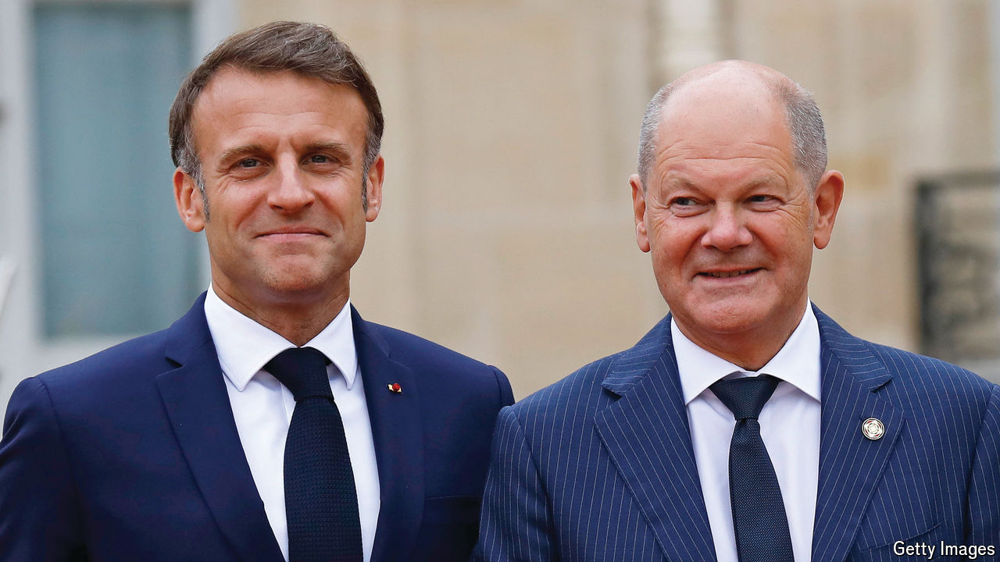

###### Adapting to Trump’s world

# Europe needs to wake up and look after itself 

##### The biggest obstacle is Germany, which now urgently needs elections 

 

> Nov 7th 2024 

Had Kamala Harris won on November 5th, Europe would have heaved a huge sigh of relief, turned over, and promptly gone back to sleep. Donald Trump’s first presidency, followed by the full-scale invasion of Ukraine by Russia in February 2022, had served as a pair of noisy wake-up calls, forcing Germany’s chancellor, Olaf Scholz, to invoke a , a historic turning-point, in defence and security. But as the war in Ukraine has settled into a grinding, slow-motion endurance test, European countries have been distracted by the concerns of voters about eroding pay-packets, surging migration and failing health-care systems. Many have returned to the habitual complacency that comes from sheltering peacefully for 80 years under America’s mighty umbrella.

