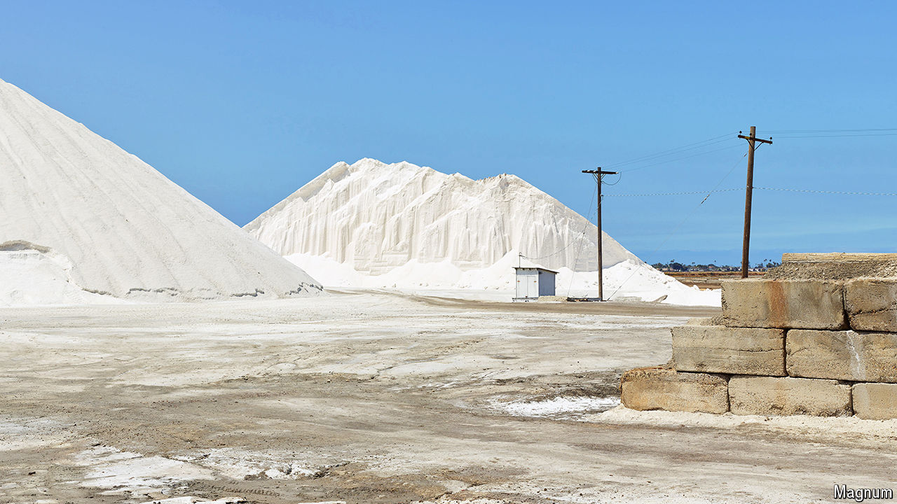

###### Worth its salt

# As wellness trends take off, iodine deficiency makes a quiet comeback 

##### Levels of the vital nutrient are falling rapidly in America 

 

> Nov 6th 2024 

A CENTURY AGO, much of northern America was known as the goitre belt. In some regions, anywhere from 26% to 70% of school-aged children had the characteristic neck swellings, or goitres, caused by an enlargement of the thyroid gland. After trials showed that supplements of iodine could prevent goitre, iodised salt was rolled out commercially in 1924, starting in grocery stores in Michigan. By the 1940s, the goitre belt had vanished. 

