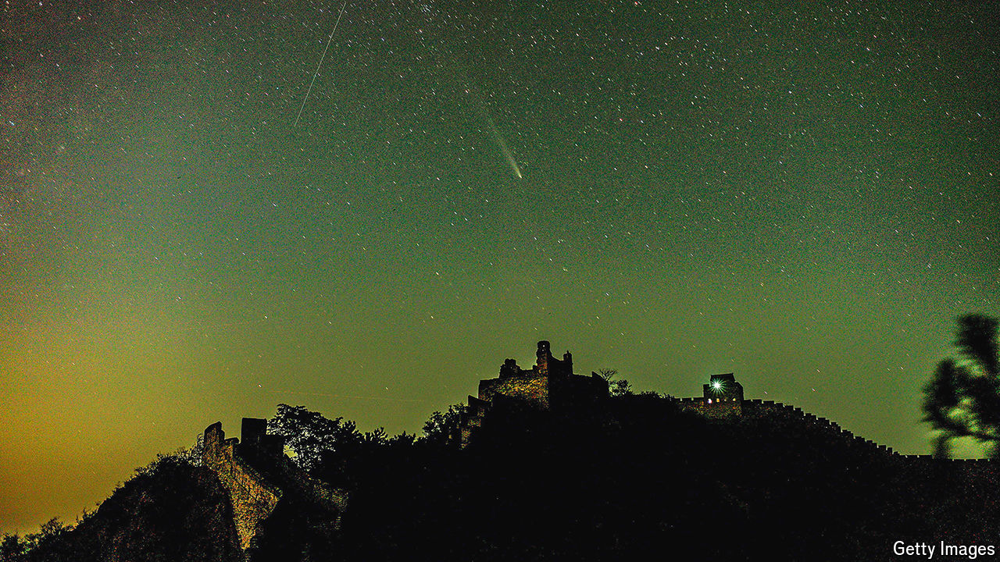

###### Crash course

# China plans to crash a spacecraft into a distant asteroid 

##### It will be only the second country to conduct such a planetary defence experiment 

 

> Nov 5th 2024 

SPACE ROCKS collide with Earth’s atmosphere all the time. The vast majority are too small to do any damage, but the risk of a larger asteroid (or comet) wiping out an underprepared city is one that space agencies around the world are taking seriously. The first goal of such would-be planetary defenders is detection: finding all objects capable of wreaking such damage and confirming that they are not on a collision course with Earth. The other goal is testing technologies that could either destroy any sizeable asteroids speeding towards the planet or else, more plausibly, deflect them away from it. 

