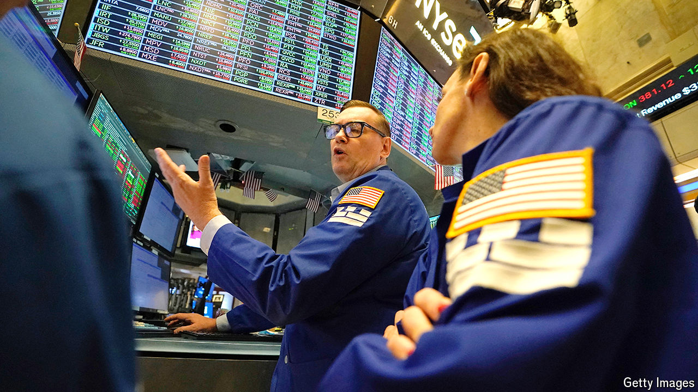

###### The world this week

# Business 

#####  

 

> Nov 7th 2024 

 to Donald Trump’s victory in America’s election. The dollar soared, rising by the most in a day against a basket of currencies for two years. The Mexican peso and the Chinese yuan tumbled amid fears of higher tariffs and more trade protectionism. The  also lifted stockmarkets. The biggest winners were companies thought to be favoured by Mr Trump. Tesla’s stock jumped, as did shares in banks, which will profit from Mr Trump’s promise to overhaul America’s regulatory agencies; he has said he will fire the chairman of the Securities and Exchange Commission. Bitcoin surged to almost $75,000, beating its previous record in March. Mr Trump wants to make America the “crypto capital of the planet”. 

